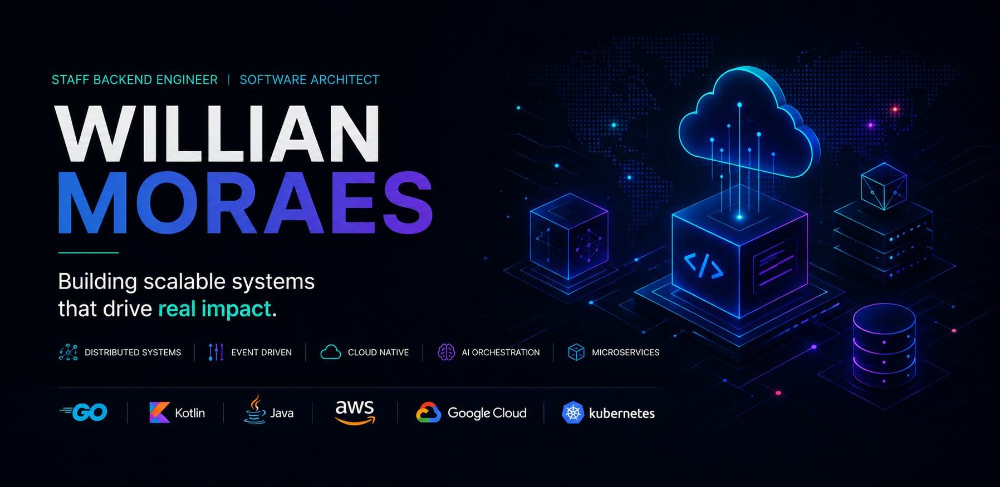

<div align="center">



<br>

# Hey, I'm Willian 👋

### Backend Engineer • Software Architect

Building distributed systems, cloud-native platforms and intelligent workflows.

<br>

<p>
  
  
  
  
</p>

</div>

---

## 🚀 What I work with

- Distributed Systems
- Event-Driven Architecture
- Cloud Platforms
- Platform Engineering
- AI Orchestration
- Scalability & Reliability

---

## 🧠 What I enjoy building

Systems that continue working when complexity starts growing.

Most of my experience comes from real production environments:
- fintech
- logistics
- scalable backend platforms
- critical integrations
- cloud-native systems

The kind of software people only notice when it fails.

---

## ⚡ Current interests

```txt
→ AI Agents & Orchestration
→ Distributed Workflows
→ Event Streaming
→ Cloud-Native Architectures
→ Developer Platforms
```

---

## 🛠️ Tech Stack

| Area | Technologies |
|---|---|
| Backend | Go, Kotlin, Java, Python |
| Cloud | AWS, GCP, Kubernetes, Docker |
| Architecture | Microservices, Kafka, Event-Driven Systems |
| Data | PostgreSQL, MySQL, Redis, MongoDB |
| Observability | Prometheus, Grafana |

---

## 📦 Featured Projects

### 🔹 event-driven-workflows
Lightweight workflow orchestration engine for distributed environments.

### 🔹 ai-agent-orchestrator
Experiments around autonomous agents and AI-driven workflows.

### 🔹 cloud-native-template
Production-ready backend foundations using Kubernetes and observability.

### 🔹 kafka-streams-examples
Examples of scalable event streaming and asynchronous communication patterns.

---

## 📌 About this GitHub

Most of the systems I built throughout my career are private enterprise platforms.

So this profile focuses less on “everything I've built”  
and more on:
- architecture thinking
- engineering decisions
- scalability patterns
- experimentation
- technical direction

---

## 🌍 Connect

<div align="center">

<a href="https://www.linkedin.com/in/willmoraes/">
  
</a>

</div>

---

<div align="center">

### “Great systems survive complexity.”

</div>
